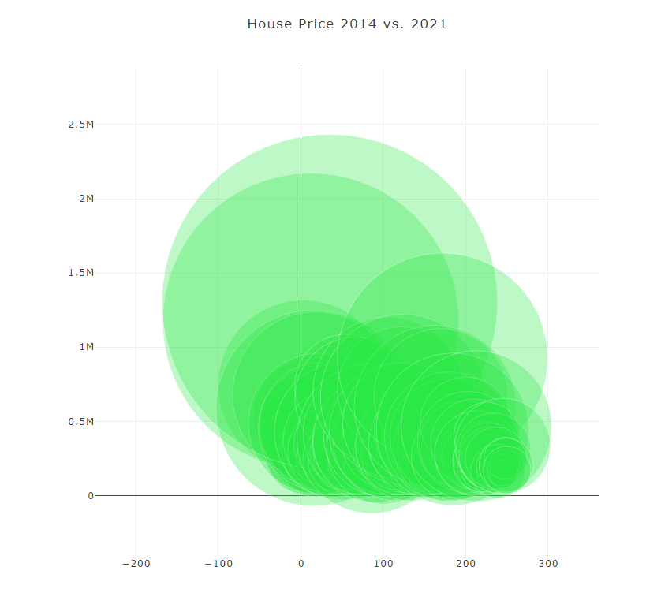
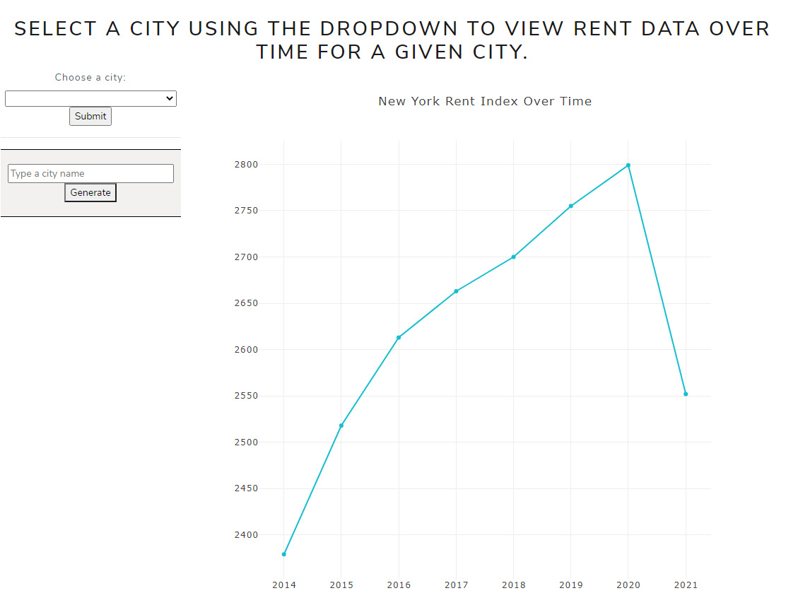
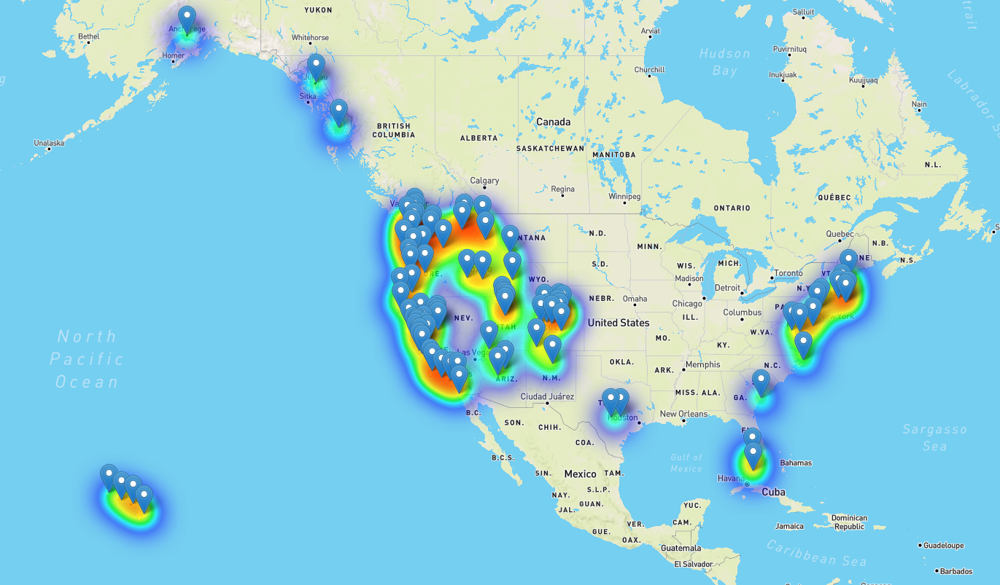
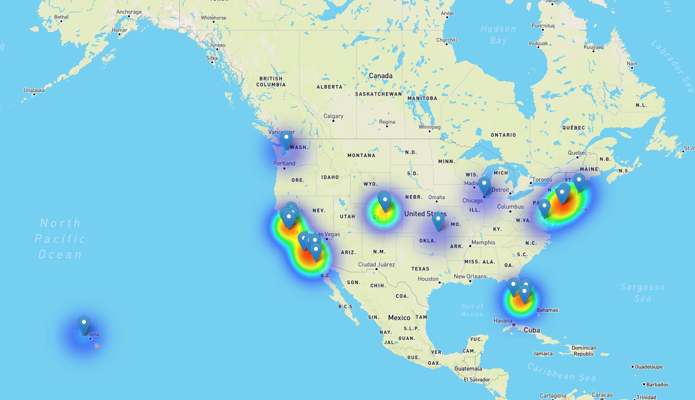

# Zillow Analysis
### Contributors: Mary Bellavia, Garrett DeBlois, Irene Zou
### [Heroku Deployment](https://zillow-analysis.herokuapp.com/)

## The Data
* All models and maps were created using open source data provided by [Zillow](https://www.zillow.com/research/data/). The precise meaning of house and rental index as described by Zillow about their data is listed below

Zillow defines the Zillow Home Value Index (ZHVI) as:
> "A smoothed, seasonally adjusted measure of the typical home value and market changes across a given region and housing type. It reflects the typical value for homes in the 35th to 65th percentile range. The raw version of that mid-tier ZHVI time series is also available.
> ZHVI represents the “typical” home value for a region. When referring to the ZHVI dollar amount, it should be designated as the “typical home value for the region.” An earlier version of ZHVI represented a median value, but this is no longer the case. Wording should be changed to reflect the new ZHVI, and should be “typical home value” — it is NOT the “median home value”."
-- [Zillow Research Data](https://www.zillow.com/research/data/)

Zillow defines the Zillow observed rent index (ZORI) as:
>"A smoothed measure of the typical observed market rate rent across a given region. ZORI is a repeat-rent index that is weighted to the rental housing stock to ensure representativeness across the entire market, not just those homes currently listed for-rent. The index is dollar-denominated by computing the mean of listed rents that fall into the 40th to 60th percentile range for all homes and apartments in a given region, which is once again weighted to reflect the rental housing stock."
-- [Zillow Research Data](https://www.zillow.com/research/data/)

## Data Cleaning
* Analysis on Zillow's rental and housing data includes the following:
- working with the time series tables;
- changes made to the data types and data formats;
- organizing columns to a cleaner form;
- acquire information from google geo api.
* In addition to using the data provided by Zillow, we used the the [Geocoding API by Google](https://developers.google.com/maps/documentation/geocoding/start) to pull latitude and longitude data for each of the cities in each of the respective datasets.

## Images of Charts & Graphs Analysis
### Bubble Chart

### Line Graph

### House Heatmap

### Rent Heatmap

